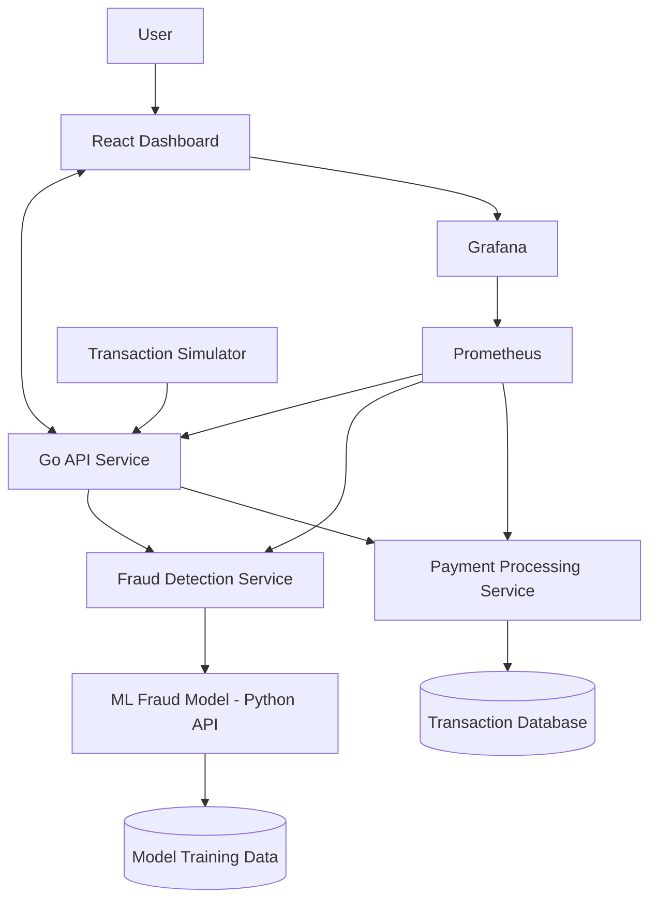
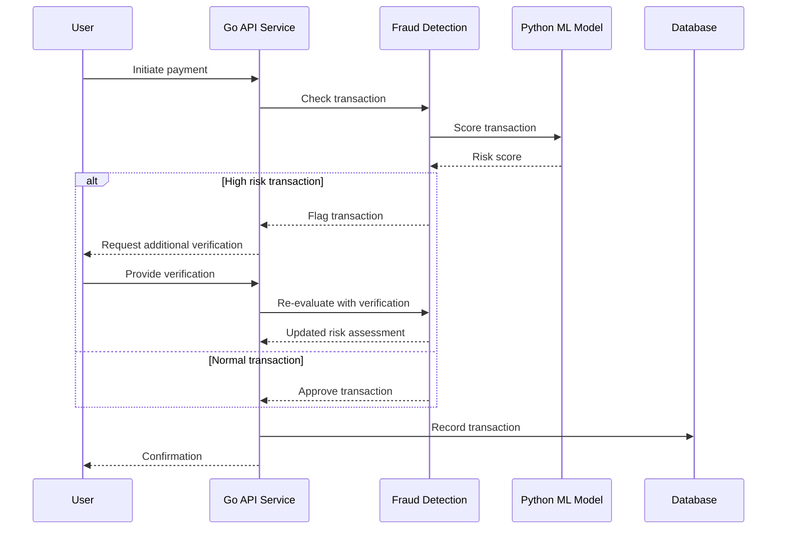
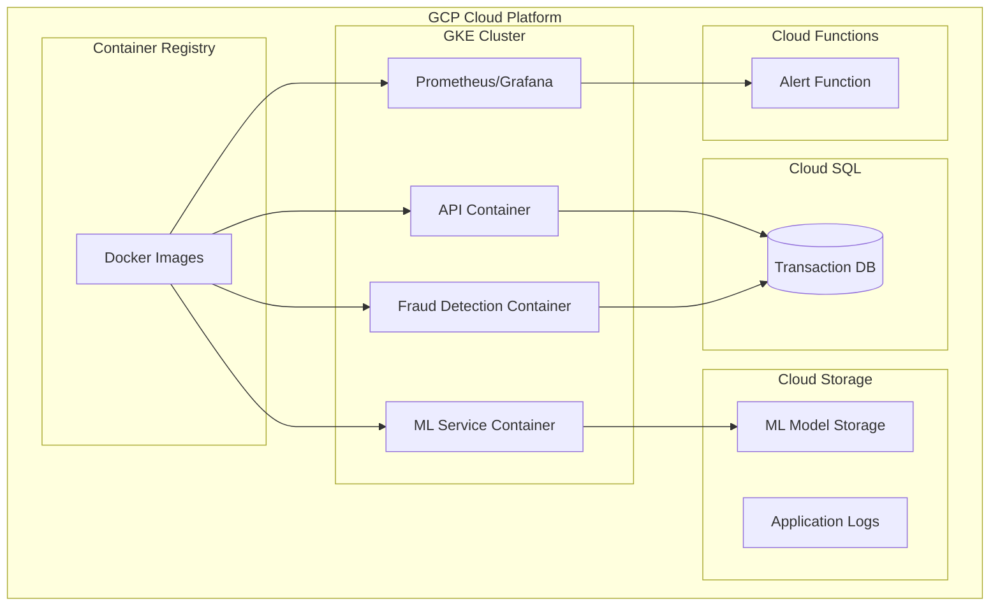

# 💸 Fraud Detection for P2P Payments (Merpay Clone)

A full-stack simulation of a fintech platform like **Merpay**, focused on **real-time fraud detection**, **ML integration**, and **site reliability engineering (SRE)**. This project demonstrates payment processing, anomaly detection, monitoring, and infrastructure-as-code — all tailored for scalable cloud deployment.

> **Note:** This project is currently under development and not yet live.

## 📌 Project Overview

This project replicates core features of a modern P2P (peer-to-peer) payments platform, with an emphasis on **fraud prevention**. It demonstrates:

- **Real-time transaction monitoring**
- **Machine Learning for anomaly detection**
- **Microservices with Go**
- **Frontend dashboard (React)**
- **Infrastructure as Code (Terraform-ready)**
- **SRE tools like Prometheus and Grafana**
- **Chaos engineering experiments**

## ⚙️ Tech Stack

| Layer           | Technology                         |
|----------------|-------------------------------------|
| Frontend        | React                               |
| Backend         | Go, Python (Scikit-learn)           |
| ML Model        | Isolation Forest / Autoencoder      |
| Monitoring      | Prometheus, Grafana                 |
| Infra-as-Code   | Terraform (future GCP deployment)   |
| Data Simulation | Python (Faker)                      |
| Containerization| Docker, Docker Compose              |

## 🛠️ Features (In Development)

### 🔐 Fraud Detection System
- Simulated payment data with realistic user behavior using `Faker`
- Trained ML model to detect transaction anomalies
- Go backend service processes each transaction and flags suspicious activity in real-time

### 📊 Real-time Monitoring
- Prometheus scrapes custom metrics from the Go microservice
- Grafana dashboard visualizes flagged transactions and service health

### ☁️ Cloud-Ready Architecture
- Terraform scripts are prepared for provisioning resources on GCP
- Deployment steps will be added once cloud rollout is complete

## 🧠 Architecture

### System Overview

### Data Flow

### Proposed Deployment Architecture

## 📊 Monitoring Dashboard (Planned)

The Grafana dashboard will provide real-time visibility into:

- Transaction volume and suspicious activity rates
- Service health metrics (latency, error rates, resource usage)
- ML model performance metrics (precision, recall, F1 score)
- Geographic distribution of flagged transactions

## 🧪 ML Model (Target Performance)

The fraud detection model aims to achieve:

- **95%+** precision in identifying fraudulent transactions
- **90%+** recall of actual fraud cases
- Average detection latency of **<50ms**

The model will be periodically retrained with newly labeled data to adapt to evolving fraud patterns.

## 🚀 Development Roadmap

### Current Phase
- Building core infrastructure components
- Developing initial ML models
- Creating frontend dashboard prototypes

### Next Steps
- Complete Docker containerization
- Finalize local development environment
- Implement initial fraud detection algorithms

### Prerequisites (For Future Contributors)
- Docker and Docker Compose
- Go 1.19+
- Python 3.9+
- Node.js 16+

## 📝 Planned Features

- [ ] Complete local development environment
- [ ] Deploy to Google Cloud Platform using Terraform
- [ ] Implement real-time user behavior analysis
- [ ] Add device fingerprinting for transaction risk scoring
- [ ] Integrate with external fraud databases
- [ ] Implement A/B testing framework for model improvements

## 📜 License

This project is licensed under the MIT License - see the [LICENSE](LICENSE) file for details.
